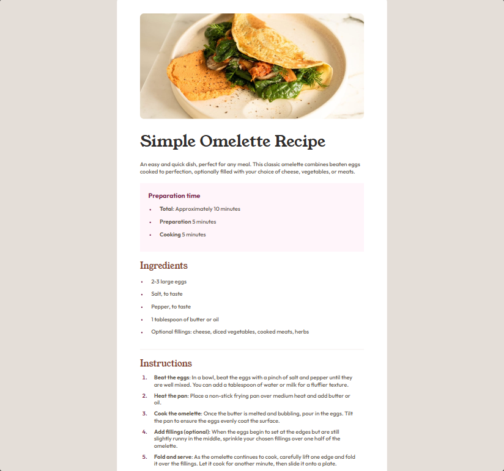
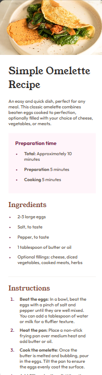

# Frontend Mentor - Recipe page solution

This is a solution to the [Recipe page challenge on Frontend Mentor](https://www.frontendmentor.io/challenges/recipe-page-KiTsR8QQKm). Frontend Mentor challenges help you improve your coding skills by building realistic projects.

## Table of contents

- [Overview](#overview)
  - [The challenge](#the-challenge)
  - [Screenshot](#screenshot)
  - [Links](#links)
- [My process](#my-process)
  - [Built with](#built-with)
  - [What I learned](#what-i-learned)
  - [Continued development](#continued-development)
  - [Useful resources](#useful-resources)
- [Author](#author)
- [Acknowledgments](#acknowledgments)

## Overview

### Screenshot

## Desktop

## Mobile

### Links

- Solution URL: [Github](https://github.com/iamprincetj/recipe-page-main)
- Live Site URL: [recipe-page-main](https://iamprincetj.github.io/recipe-page-main/)

## My process

### Built with

- Semantic HTML5 markup
- CSS custom properties
- Flexbox
- CSS Grid
- Mobile-first workflow

- Website - [Add your name here](https://www.your-site.com)
- Frontend Mentor - [@iamprincetj](https://www.frontendmentor.io/profile/iamprincetj)
- Twitter - [@yourusername](https://www.twitter.com/yourusername)
